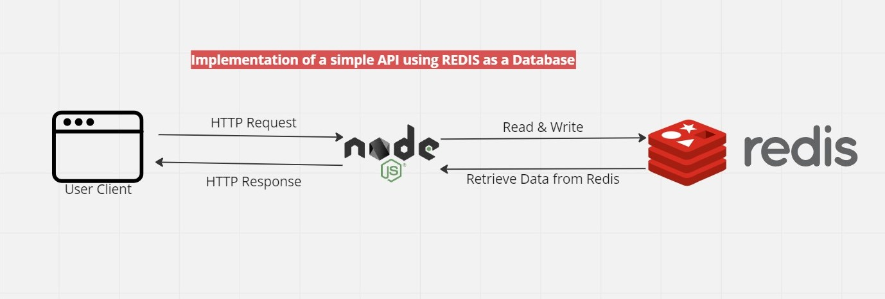

# Redis_DB

## Background Context

An implementation of a CRUD API using NodeJS and redis as a Non-relational database.

Redis is an in-memory data structure store, used as a distributed, in-memory key-value database, cache and message broke with optional durability.

Here is the gist, most people don't know that redis can be used as a non-relational database. Well, before now redis is mostly used for caching and message broking. In recent times, it can be used as a Non-relational database. Since Redis offers cashing and message broking out of the box already it makes it fun and interest using it as a primary database for applications.

Redis provides a package called Redis OM. This is a library that provides object mapping for Redis, see it like an ORM or an ODM. It enable developers communicate with the redis server easily.

As you can see from the above diagram, this project is just a simple CRUD API implemented using NodeJS as the server runtime environment, expressJS, a framework for NodeJS and Redis as the primary database.

It should be noted that for this project, the redis cloud was used and not the local storage(localhost). However the local storage can be used as well.

## Functionalities
- Creating a user to the Redis database
- Retrieving a particular user created from the Redis database
- Updating a user information in the Redis database
- Deleting a user from the Redis database
- Retrieving all users created from the Redis database.

## methods
- **createPerson**: This method creates a new user and saves it in the database. It takes in firstname, lastname, age, email and password as request body
- **getPersonById**: This method retirieves a user by the id. It is implemented by passing the id as a request parameter.
- **updatePerson**: This method updates a user by the id of that id. It is implemented by passing the id as a request parameter and also the firstname, lastname, age, email, and password as request body.
- **deletePerson**: This method deletes a user by the id. It is implemented by passing the id as a request parameter.
- **getAllPersons**: This method retrieves all the users saved in the Redis database.

## Endpoints
- *POST* **{{URL}}/api/person** - create a new user
- *GET* **{{URL}}/api/person/:id** - retrieves a particular user
- *PUT* **{{URL}}/api/person/:id** - updates a particular user
- *DELETE* **{{URL}}/api/person/:id** - deletes a particular user
- *GET* **{{URL}}/api/persons** - retrieve all users

## Usage
This project is open to use by anyone. To use it make sure you have node installed on your machine. You can as well install redis but if you can't, don't worry about it, I got you covered. All you have to do is go to https://redis.com and sign up, it's totally free, when you sign up, you will be allocated with 30GB of Redis cloud server and you will be given a url of which encompases your username and password.

Now that everything is in place, let's dive straight in😊😊😊.

1. Clone this repo to your local machine.

2. Open your terminal and create a .env file
> touch .env

3. Inside the .env file fill in the following
```
PORT=***
REDIS_URL=****
```
Ensure to replace the *s with the port number of your choice and your redis url either gotten from the redis cloud server or from your local machine.

4. Now you have to install all the dependencies by using:
> npm install

5. Now run your application:
> npm start

viola 😊😊😊 you're all set. Enjoy.

## Notes
It is recommended to download RedisInsight which is a GUI of redis server. It helps in having a view and a fill of data saved to the database as it can be difficult or almost impossible to get keys of our data in the redis cloud server.

You can download RedisInsight from https://redis.com

## Resources
- The official documentation of Redis OM for NodeJS helped a great deal - https://redis.io/docs/stack/get-started/tutorials/stack-node/

## Author
- Riches Arise Kolizibe - [please reach out to me for any corrections or opinions or projects](richkole8@gmail.com)